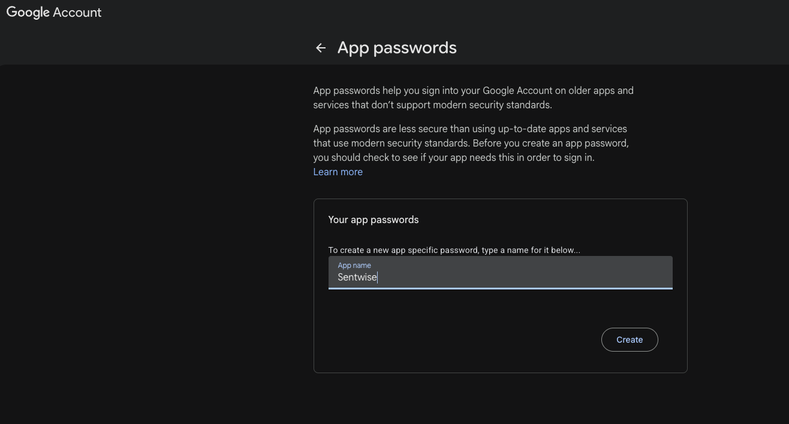
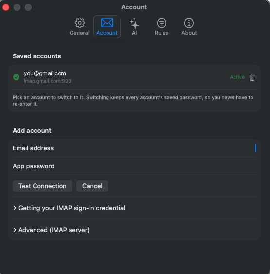
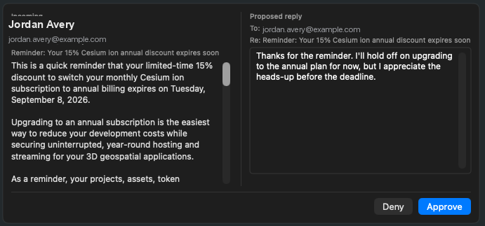

# Sentwise

**Your follow-up email is drafted before you're back from the coffee machine.**

Sentwise is a native, local-first macOS menu-bar assistant that learns your
writing voice from your own Sent mail and drafts email on your behalf — then
alerts you when a draft is ready so you can read it in full and approve it in
the app. Sentwise does not store your mail, voice profile, or call transcripts
on Sentwise servers. With managed inference, the text needed for drafting or
voice learning transits a stateless, zero-retention proxy; with a BYO provider,
that provider's policies apply; with a same-Mac local model, inference stays on
your Mac.

The flagship workflow is the **post-call follow-up**: when a call ends, drop in
the transcript and Sentwise drafts the next-steps email in your voice, addressed
and ready to send. It also watches your inbox and drafts replies to mail that
deserves one. You stay in the loop — every draft waits for your approval.

> **Release note:** This README describes the current source branch. The latest
> packaged prerelease is v0.1.2, which predates managed sign-in/trial onboarding,
> signature controls, Report a Problem, the Open/Close notification flow, and
> other post-August 19 launch polish. Build from source for those until a newer
> package is published.

## Why Sentwise

Most AI email tools are cloud services that read your mail on their servers,
store your calls indefinitely, and train their models on your data. Sentwise is
built the opposite way:

- **No Sentwise storage, no Sentwise training.** Managed drafting runs through a
  **stateless, zero-retention** inference proxy — request and response bodies are
  held in memory only and never logged or kept by Sentwise. BYO requests go
  directly to the provider you choose under that provider's policy; same-Mac
  local-model requests stay on your Mac.
- **No bot in your meetings.** Sentwise never joins your calls. Transcripts
  arrive as a paste, file, or local watched folder (meeting-platform pickup and
  on-device capture are on the roadmap), not as a cloud meeting archive;
  transcript text is sent only when a non-local inference provider drafts from
  it.
- **A send-ready email, not a summary.** The output is a finished draft in
  *your* learned voice, sent from *your* mailbox — not a note stranded in a
  separate app.
- **Native, not a browser tab.** A real menu-bar Mac app, installed from a
  signed DMG or Homebrew and kept current with automatic updates.

## What it does

- **Post-call follow-ups** — ingest a call transcript (paste, file, or a watched
  folder that picks up new exports automatically) and draft the next-steps email
  in your voice, with recap, action items, and a proposed next step.
- **Inbox reply drafting** — watches your Gmail inbox while your Mac is awake and
  drafts replies to mail worth answering.
- **Learns your voice** from your Gmail Sent folder, and re-learns on demand.
- **Review and approve in the app** — a native macOS notification tells you a
  draft is ready; you open the Review Drafts window, read the full draft, and
  approve it deliberately. Approving either **saves it to your Gmail Drafts** or
  **sends it** (your choice), with an optional undo window on auto-send.
- **Your signature**, applied automatically — set it yourself or let Sentwise
  suggest one from your Sent mail.
- **Report a Problem** from the menu bar packages a redacted diagnostic log — no
  email content — so issues are fixable without you sending anything sensitive.

## How you connect and pay

- **Sign in and go.** Create an account; your 14-day trial starts on the first
  managed inference request, including voice learning or drafting — no API key,
  no provider billing, drafting included. Managed inference is the default; you
  never touch a key.
- **Or bring your own.** Prefer to run it yourself? Point Sentwise at your own
  provider key (via OpenRouter and others) or a **local model** (e.g. Ollama).
  On this path, drafting never touches our servers at all. Your keys live in the
  macOS Keychain.
- **Connect Gmail** by pasting your address and a 16-character Google **app
  password** (requires 2-Step Verification) — no Google Cloud console, no OAuth
  setup.

The planned paid model is a subscription with the AI included. Checkout/licensing
is still in progress, so after a source-build managed trial expires, use the
BYO/local-provider path until the paid path ships. The source is public —
self-compilers are welcome; the signed, auto-updating binary is licensed to your
account.

## Quickstart

> **Packaged prerelease v0.1.2 is available now.** It installs from the latest
> GitHub release DMG or the qualified Homebrew tap below, but it predates managed
> sign-in/trial onboarding and later source-branch features. Use it for the
> BYO/local-provider flow, or [build from source](#build-from-source) to follow
> the managed quickstart below.

1. **Install.**
   - Download the latest DMG from [Releases](https://github.com/michaeltookes/sentwise/releases/latest) and drag Sentwise to Applications, **or**
   - `brew install --cask michaeltookes/tap/sentwise`

   The current package installs v0.1.2; build from source for managed sign-in and
   post-August 19 source-branch features until a newer package is published.
   Sentwise lives in your menu bar (no Dock icon) and keeps itself up to date.

2. **Connect your Gmail.** You'll need a Google **app password** (Gmail's
   per-app credential), which requires 2-Step Verification on your account:
   1. Turn on 2-Step Verification at <https://myaccount.google.com/security>.
   2. Create an app password at <https://myaccount.google.com/apppasswords>;
      for Google Workspace accounts, your admin must allow IMAP and app
      passwords, and security-key-only policies can block app passwords even
      after 2-Step Verification is on.
   3. Paste your email address and the 16-character password into Sentwise.

   

   Google then shows a 16-character password — copy it and paste it, with your
   email address, into Sentwise's Add account fields:

   

3. **Choose your AI.** After Gmail connects, sign in with your email to use
   managed inference. Drafting is included, and your 14-day trial starts when
   managed inference is first used, whether for voice learning or drafting — no
   key to paste.

   *(Prefer to bring your own key or a local model? Choose that provider instead
   — see [Bring your own provider](#bring-your-own-provider).)*

4. **Learn your voice.** Sentwise samples your Sent mail to build a private voice
   profile. The profile is stored locally; when you use managed or BYO
   inference, the sampled text is sent to that inference endpoint for profiling.
   With managed inference, this starts the trial clock.

5. **Get your first draft.** Send a test email to the connected Gmail account
   from another address (or drop in a call transcript via **New Follow-up from
   Transcript…**). When the draft is ready, the notification banner appears —
   open it, read the full draft in Review Drafts, add recipients if you started
   from a transcript without them, and approve.

   

### Bring your own provider

Sentwise's managed inference is the default, but the BYO path is a first-class
option for power users and the privacy-maximal:

- In **Settings → AI provider**, choose your provider and paste your key (stored
  in the Keychain), or point Sentwise at a **same-Mac local model** (e.g. Ollama
  on localhost) for on-device drafting.
- On this path, drafting requests go directly from your Mac to the provider you
  chose and follow that provider's retention and training policy — never through
  our proxy. With a loopback local model, the request stays on your Mac; with a
  LAN or remote endpoint, it goes to the host you configured.

## Privacy in one screen

- **What Sentwise stores locally:** your learned voice profile, settings, pending
  drafts, and transcript files you provide. Sentwise does not store your email
  or call content on its servers.
- **What leaves, and when:** non-local inference requests include the content
  needed for the job — Sent-mail samples for voice learning, incoming email text
  for replies, or transcript text for follow-ups. Managed inference sends that
  through a **stateless, zero-retention** proxy; BYO inference sends it directly
  to the provider you choose; local-provider inference stays on this Mac only
  when its endpoint is loopback/localhost, and otherwise goes to the configured
  LAN or remote endpoint.
- **What the account stores:** your account email and trial/subscription state
  — **never your email or call content.**
- **What Sentwise never does:** your content is never logged or stored on
  Sentwise servers and never used by Sentwise to train models. BYO provider
  retention and training are governed by the provider you select.

## Requirements

- macOS 14 (Sonoma) or later
- A Gmail account with 2-Step Verification (for the app password)
- Xcode 16 or later (only to build from source)

## Build from source

```bash
git clone https://github.com/michaeltookes/sentwise.git
cd sentwise/Sentwise
open Sentwise.xcodeproj
```

Select the **Sentwise** scheme and run. To build and test from the command line:

```bash
cd Sentwise
xcodebuild test -project Sentwise.xcodeproj -scheme Sentwise \
  -destination 'platform=macOS'
```

A few integration tests verify the real IMAP/SMTP path against a live mailbox.
They are credential-gated and skip by default; see
[`docs/live-verification.md`](docs/live-verification.md) to run them.

## Roadmap

Sentwise is in active development toward its 1.0 release. Shipping next:
subscription checkout, a landing page, and 1.0 polish for the signed
DMG/Homebrew distribution already available as prereleases. On the longer
roadmap: calendar-aware follow-up recipients, automatic transcript pickup from
meeting platforms, on-device call capture and transcription, a Slack approval
channel, and Outlook/M365 support.

See [`docs/backlog.md`](docs/backlog.md) for the full roadmap and
[`docs/resolved.md`](docs/resolved.md) for what's already shipped.

## Contributing

Contributions are welcome — see [`CONTRIBUTING.md`](CONTRIBUTING.md) for build,
test, and pull-request guidelines, and
[`CODE_OF_CONDUCT.md`](CODE_OF_CONDUCT.md).

## License

[MIT](LICENSE) © 2026 Michael Tookes
